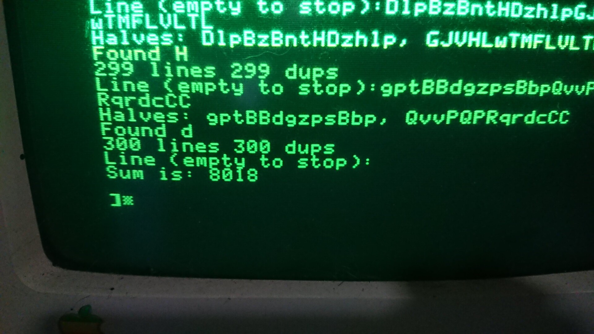
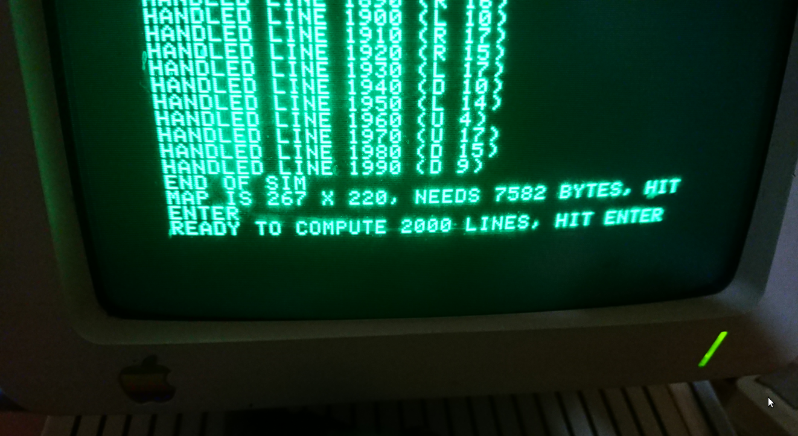

== Day 1 ==
Nothing particular

== Day 2 ==
```
gcc day-2-2.c && cat inputs/i2.txt | ./a.out
```

== Day 3 ==

For part 1, install the serial monster between laptop and Apple //c

```
sudo apt install minicom
sudo stty -F /dev/ttyUSB0 9600 -parity cs8 -parenb -parodd -crtscts
```

On the Apple //c, boot prodos, go to Basic then configure serial input:

```
] IN #2
] <Ctrl-A>14B
```

On the laptop, send the source code:

```
ascii-xfr -nsv -l 500 -c 5 day-3-1.applesoft.basic > /dev/ttyUSB0
```

On the Apple //c, type

```
] RUN
```
On the laptop, send the data file, one line every 7 seconds, 30ms between each character:

```
ascii-xfr -nsv -l 7000 -c 30 inputs/i3.txt > /dev/ttyUSB0
```

Result: 


== Day 4 ==

Same procedure

== Day 5 ==

Spaces at start of lines are ignored if entered raw, we have to prefix a double-quote
to have full lines before feeding them to the Apple //c.

Hence, the input file is preprocessed with sed:

```
sed -i 's/^/"/' inputs/i5.txt
```

== Day 6 ==

Input consists of a very long line, so we will adapt the inter-character delay 
of ascii-xfr:

```
ascii-xfr -nsv -l 100 -c 100 inputs/i6.txt > /dev/ttyUSB0
```

Also, I used ingest.basic to save the data to a floppy, and read it from the
floppy. It allowed the main program to run faster.

== Day 7 ==

Input starting with $ is interpreted as hexadecimal number, so we preprocess 
input with sed to prefix each line with a quote:

```
sed -i 's/^/"/' inputs/i7.txt
```
I tried to save it locally using my ingest.basic file, but the Apple //c hangs
at around 6.2kB and I can't understand why, so back to ascii-xfr.

Once input stops, the user has to hit ENTER until we're back at the / level of
the "filesystem" before getting the result.

Luckily my tracing PRINT showed the total when exiting a directory, saving me
an extra run before doing part 2!

== Day 8 ==

Now that's complicated. Memory's limited and I can't use as many arrays as I
want to. DIM A(100,100) directly gives an OUT OF MEMORY ERROR.

DIM A$(100,100) is OK so we're going to use ASC() and CHR$ a lot.

First try failed because accessing memory is slower the further you are in the
array, and I missed starts of lines sent via serial. Didn't want to do multiple
runs to find out minimal safe delay.

Second try failed : I dumped the contents to floppy using lingest.basic and
ascii-xfr with a 5s inter-line delay. Then tried to OPEN and READ the file from
BASIC, but things got REAL slow (1 char every 10s), probably due to memory usage.

Third try, reading line by line and splitting into two-dimensional TREE$ array
during reading, got too slow after a few lines too.

Fourth try is one more loop, first reading all data, not building a bidimensional
array but instead making use of MID$, then iterating twice on that (from top-left,
then from bottom-right), then one last time to count visible trees. It failed with
an OUT OF MEMORY ERROR.

Figured out about INTEGER variables, DIM TREE%(100,100) for example. Back to reading
char by char, but this time reading everything first THEN doing the job.
Less elegant, but this one worked in a reasonable timeframe (2 hours for the 
beautiful O(4n²) algorithm of part 1).

I made myself a checklines.sh helper to verify I don't overwrite a line by 
having two of them numbered identically.

Sent data with `-l 1000 -c 350`.

== Day 9 ==

Day 9 was worse. 

Simple way to count "squares I've been in" without counting some squares multiple
times is to push ones in a bidimensional array, then walk the array. BUT. The
rope moves around a 267x220 rectangle (for my input), which means 57kB of data,
which does NOT fit in the Apple //c.

The worst way is to push each square in an array *if* it's not there already. 
Fine, but that makes the algorithm O(n^3), which is a big turnoff for me even on
a 4 GHz CPU, let alone a 1MHz CPU running interpreted code. I've still tried it,
it was agonizing and I aborted the run.

In the end, I ditched BASIC for C, using cc65. This allowed me to make my own
makeshift bidimensional array of... booleans. This of course required quite a bit
of pointer arithmetic, then quite a bit of debugging as variable overflows occur
really easily when sizeof(int) == 2...

But in the end it works, and best of all, it works for both parts!

Debugging via printf: 

